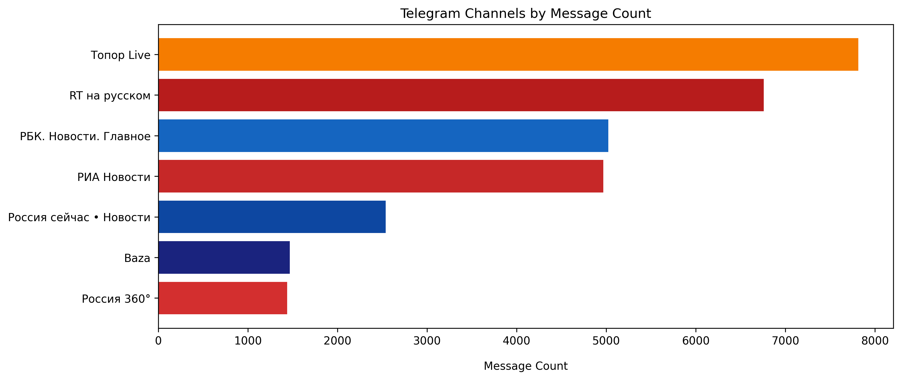
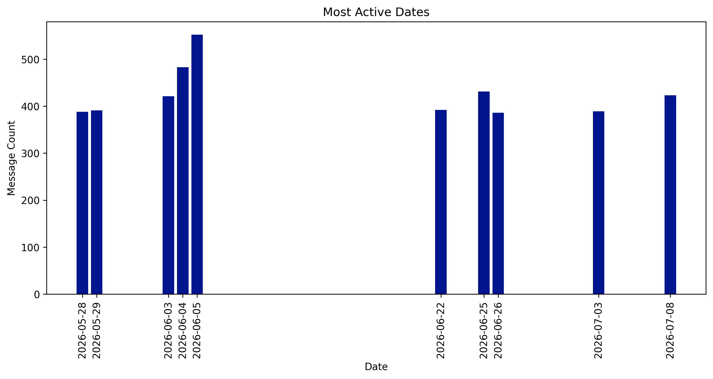
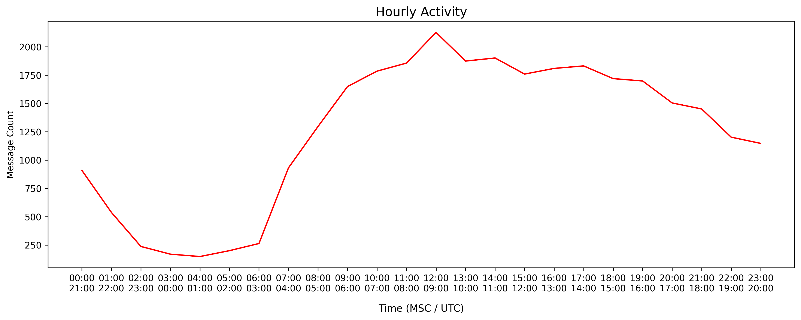
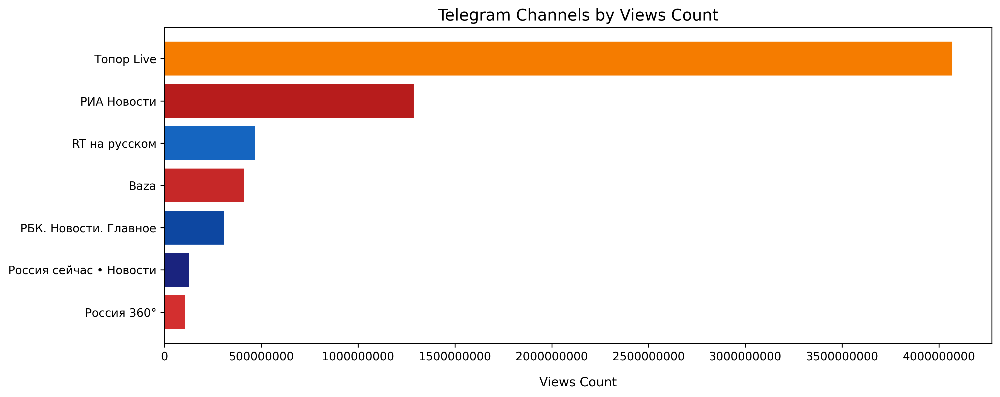
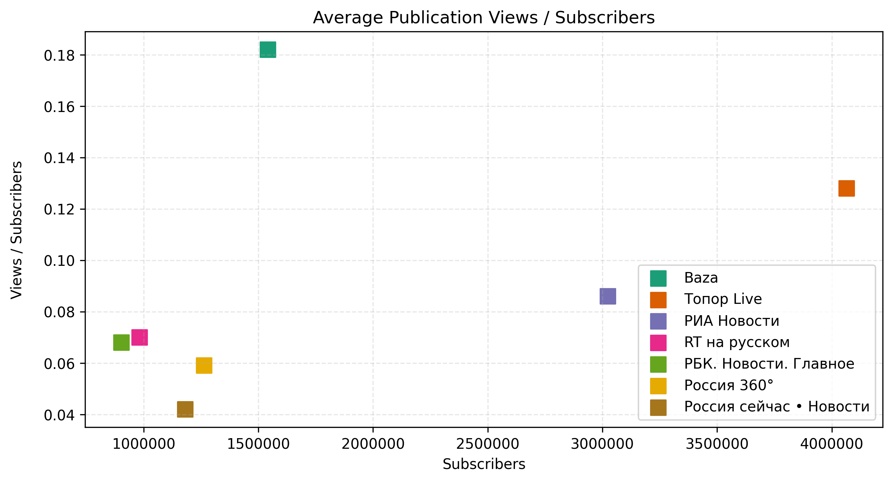
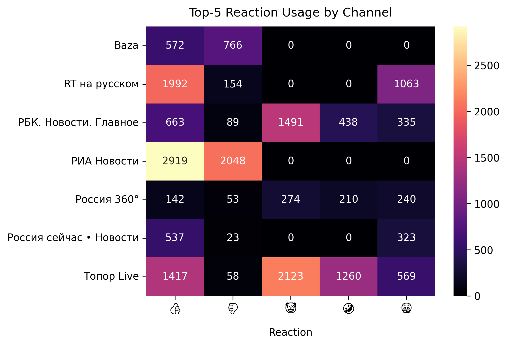

# Russian Telegram News Analyzer 


  

В рамках проекта выполняется асинхронный сбор сообщений из семи популярных российских новостных Telegram-каналов за последние 90 дней. Атрибуты каждого сообщения собираются в словарь, после чего полученный список словарей преобразуется в pandas.DataFrame. На основе полученных данных проводится анализ публикаций: рассчитываются различные статистические показатели, результаты сохраняются в CSV-файлы и визуализируются с помощью Matplotlib и Seaborn.

## Возможности
- асинхронный сбор публикаций из новостных Telegram-каналов
- обработка и очистка собранных данных
- анализ активности, популярности каналов и поведения пользователей
- сохранение результатов анализа в CSV-файлы
- построение графиков на основе результатов анализа
- логирование процесса сбора публикаций и возможных ошибок 

## Структура проекта 
```text
russian-telegram-news-analyzer/
│
├── assets/
│   └── graphs/
│
├── results/
│   ├── csv/
│   └── graphs/
│
├── logs/
│   ├── errors.log
│   └── info.log
│
├── src/
│   ├── __init__.py
│   ├── cleaner.py
│   ├── client.py
│   ├── config.py
│   ├── constants.py
│   ├── loggers.py
│   ├── processor.py
│   ├── tg_collector.py
│   ├── utils.py
│   └── visualiser.py
│
├── .gitignore
├── main.py
├── README.md
└── requirements.txt
```
> **NB!** Директории `results/graphs`, `results/csv` и `logs/` создаются автоматически во время работы проекта и не включаются в репозиторий. Конфигурационный файл и локальные файлы сессии Telegram также находятся в `.gitignore`.

## Используемые библиотеки и модули 
| Библиотека / модуль | Назначение |
|---|---|
| [Telethon](https://docs.telethon.dev/) | взаимодействие с Telegram API |
| [pandas](https://pandas.pydata.org/docs/) | обработка и анализ данных |
| [Matplotlib](https://matplotlib.org/stable/) | визуализация результатов анализа |
| [Seaborn](https://seaborn.pydata.org/) | построение тепловой карты |
| [asyncio](https://docs.python.org/3/library/asyncio.html) | асинхронное выполнение задач |
| [logging](https://docs.python.org/3/library/logging.html) | логирование процесса работы приложения |

## Запуск 

### 1. Клонирование репозитория: 
```bash
git clone git@github.com:progen1tor/russian-telegram-news-analyzer.git
cd russian-telegram-news-analyzer
```

### 2. Установка зависимостей: 
```bash
pip install -r requirements.txt
```

### 3. Настройка конфигурации: 
Создайте файл `config.json` в корневой директории проекта:
```json
{
    "api_id": YOUR_API_ID,
    "api_hash": "YOUR_API_HASH",
    "session_name": "session_name",
    "timezone": "your_timezone"
}
```
*Получить api_id и api_hash можно на [my.telegram.org](https://my.telegram.org/).*

### 4. Запуск проекта: 
```bash 
python main.py 
```

## Визуализация результатов

### Telegram Channels by Message Count 


### Most Active Dates 


### Hourly Activity 


### Telegram Channels by Views Count


### Average Publication Views / Subscribers  


### Top-5 Reaction Usage by Channel 


## Контакты
Telegram: [@ob1101](https://t.me/ob1101)